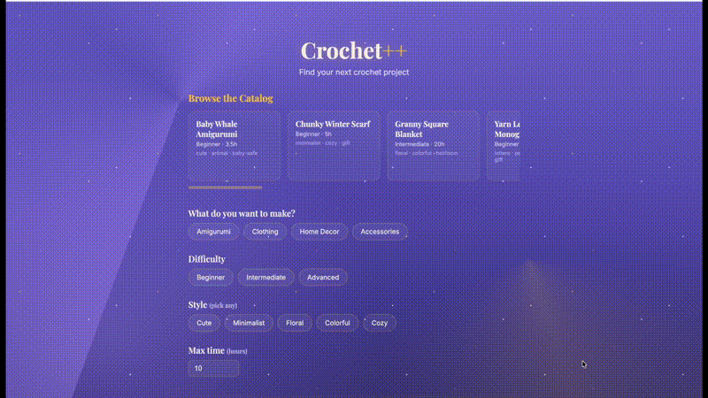
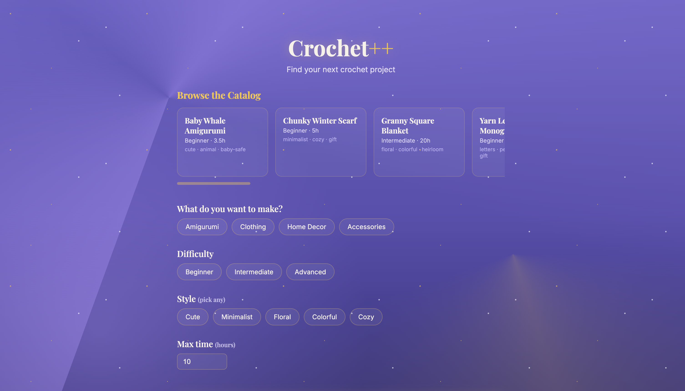
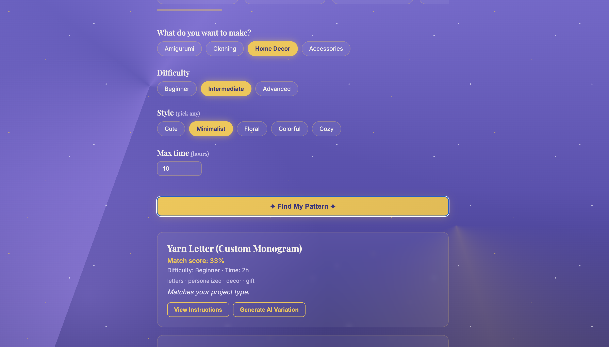
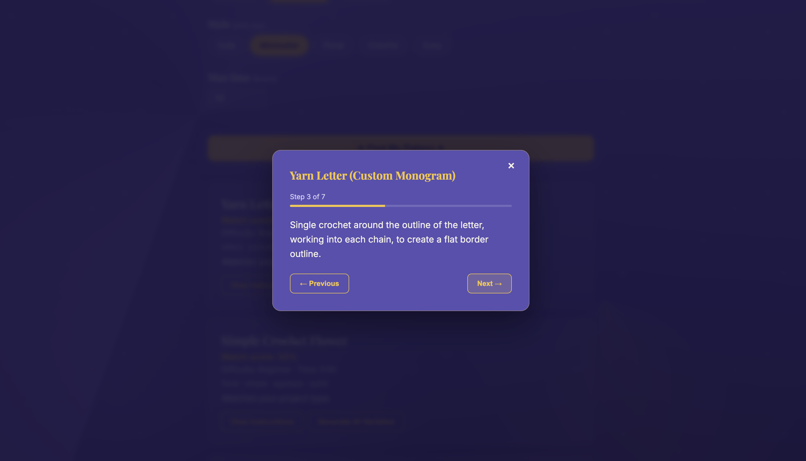
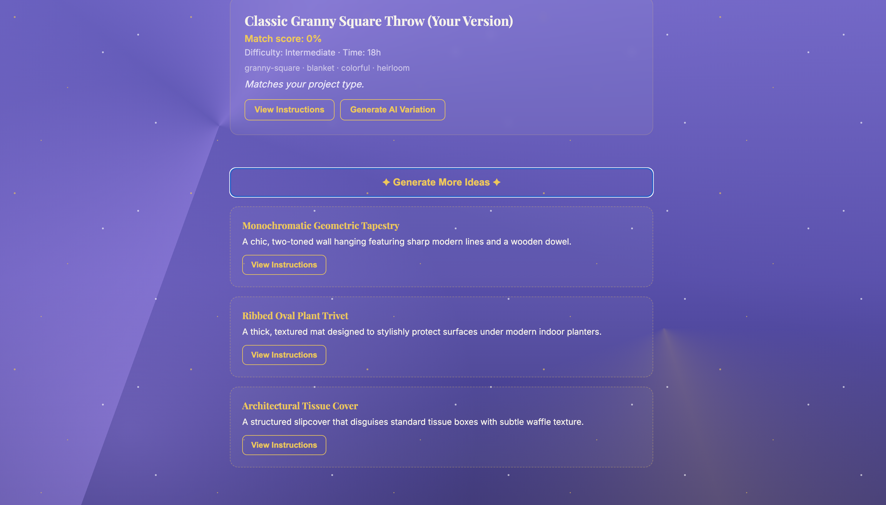
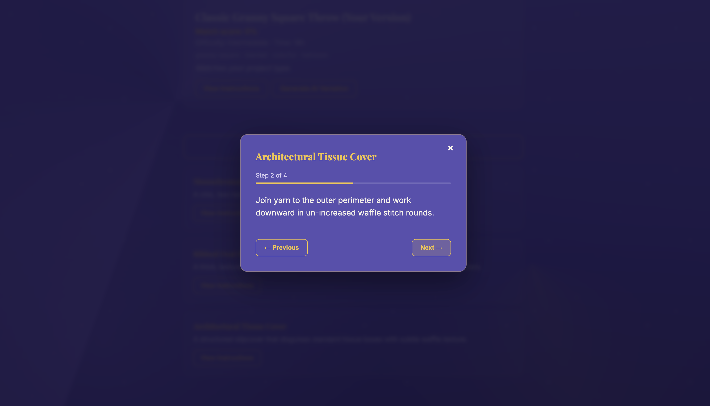
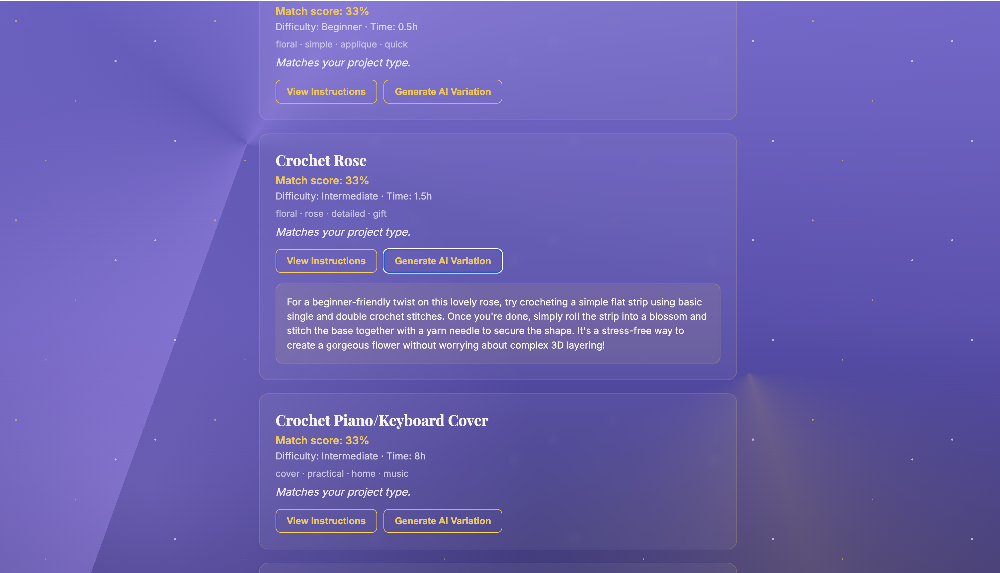

# Crochet++

A crochet pattern recommendation engine built in modern C++, with an HTTP API, a browser-based frontend, and optional Gemini AI integration for personalized pattern variations and project ideas.

Built as a learning project to gain hands-on experience with modern C++, algorithm design, HTTP APIs, external AI integration, and software testing — not just "a crochet website," but a small, real backend system with a defensible architecture.

---

## Features

- **Structured pattern catalog** — a local JSON dataset of real crochet patterns (amigurumi, accessories, home decor), each with difficulty, materials, tags, time estimates, and full step-by-step instructions.
- **Two-phase recommendation engine** — hard filtering (eliminate incompatible patterns) followed by weighted scoring and ranking, with user-adjustable dimension weights (e.g. "style matters more than time").
- **Step-by-step instruction viewer** — patterns display one instruction step at a time with progress tracking, rather than a single wall of text.
- **Browsable gallery** — a scrollable catalog view independent of the recommendation flow, for casual browsing.
- **Gemini-powered features** (optional, degrades gracefully if unconfigured):
  - Personalized pattern variations based on selected pattern + user preferences
  - AI-generated original project ideas (name, description, and instruction steps), expanding beyond the fixed catalog
- **Full test suite** for the recommendation engine (GoogleTest), covering filtering, scoring, ranking, and edge cases.
- **Designed for failure** — structured error handling at the data layer, HTTP layer, and external API layer, with distinct, correct HTTP status codes for each failure mode.

---

## Architecture

Frontend (HTML/CSS/JS)
│ fetch() / JSON over HTTP
▼
C++ HTTP Server (cpp-httplib)
│
├── Recommender — hard filtering + weighted scoring + ranking
├── PatternRepository — loads catalog from data/patterns.json
└── GeminiClient — outbound calls to Gemini API (libcurl)


**Key design principle:** the recommendation engine has zero knowledge of HTTP or AI. `Recommender` is a pure C++ component that takes a pattern list and user preferences and returns ranked results — nothing more. This is what makes it independently unit-testable (see Testing below) and keeps the core logic honest: adding or removing the HTTP layer or the AI layer never changes how recommendations are computed.

The frontend is intentionally plain HTML/CSS/JS with no framework — its only job is collecting preferences and rendering results. All business logic (filtering, scoring, ranking, AI orchestration) lives in C++.

### Project structure

crochet-project/
├── CMakeLists.txt
├── data/patterns.json # pattern catalog
├── include/crochet/
│ ├── models/ # Pattern, Preferences, enums
│ ├── data/ # PatternRepository, JSON converters
│ ├── engine/ # Recommender, RecommendationResult
│ ├── ai/ # GeminiClient
│ └── server/ # HttpServer
├── src/ # implementations, mirroring include/
├── tests/ # GoogleTest suite
└── frontend/ # static HTML/CSS/JS client


## Demo



| Home / Gallery | Selected Preferences | Step-by-step Instructions |
|---|---|---|
|  |  |  |

| AI-Generated Ideas | AI-Generated Steps | AI Variation |
|---|---|---|
|  |  |  |

---

## Recommendation Algorithm

Recommendation happens in two distinct phases:

### 1. Hard filtering
Patterns that cannot satisfy the user's request are removed outright, not down-weighted:
- Wrong project category (e.g. user wants HomeDecor, pattern is Amigurumi)
- Difficulty harder than what the user requested

### 2. Weighted scoring
Every remaining pattern is scored per-dimension (style match, time match), each multiplied by a user-adjustable weight and normalized:

score = Σ (dimension_match × user_weight) / Σ user_weight


Only dimensions the user actually specified are included in the score — a deliberate fix after testing revealed that unrequested dimensions (e.g. no style preference given) were silently receiving full credit and diluting the final score. See Testing below.

Results are sorted descending by score using `std::sort` with a custom lambda comparator.

**Complexity:** filtering and scoring are O(n) in the number of patterns; sorting is O(n log n) and dominates overall. At the current catalog size (a few dozen patterns), a full linear scan is appropriately simple — an inverted index or other search structure was considered but deliberately not built, since it would add complexity with no measurable benefit at this scale.

---

## Data Model

```cpp
struct Pattern {
    int id;
    std::string name;
    ProjectType category;
    Difficulty difficulty;
    double estimatedTimeHours;
    std::vector<std::string> tags;
    std::vector<std::string> instructionSteps;
};

struct Preferences {
    Difficulty desiredDifficulty;
    ProjectType desiredType;
    std::vector<std::string> desiredStyles;
    std::vector<std::string> desiredColors;
    double maxTimeHours;
    std::unordered_map<std::string, double> weights;
};
```

`Difficulty` and `ProjectType` are `enum class` rather than raw strings, so invalid values are a compile-time impossibility rather than a runtime bug.

---

## AI Integration

Gemini is used **only** to enhance the experience around the core recommendation engine — never to replace it. All ranking and filtering logic is deterministic C++; Gemini is called after a pattern is already selected, or to generate supplementary ideas alongside (not instead of) the real catalog.

**Endpoints:**
- `POST /variation` — generates a personalized variation description for a selected pattern, incorporating the user's color preferences
- `POST /ideas` — generates original project ideas (with instructions) matching the user's stated preferences, expanding beyond the fixed catalog

**Design decisions:**
- The API key is read from the `GEMINI_API_KEY` environment variable at startup — never hardcoded, never committed.
- If the key is missing, the app **still starts** and serves all non-AI functionality; only the AI endpoints return `503 Service Unavailable`. AI is additive, not load-bearing.
- Outbound calls use `std::optional<std::string>` rather than exceptions for failure — a deliberate choice, since a failed AI call (network blip, rate limit, upstream outage) is an expected, recoverable condition, distinct from malformed input data which *should* throw.
- A single automatic retry with a short backoff handles transient `503 Service Unavailable` responses from Gemini's own infrastructure (observed in practice during development — see Testing/Debugging below).
- LLM output is treated as untrusted: Gemini is instructed to return raw JSON, but the code defensively extracts content between the first `[` and last `]` before parsing, since LLMs don't always follow formatting instructions exactly.

---

## C++ Concepts Demonstrated

- **Modern C++ (C++20):** `enum class`, `auto`, range-based for, structured bindings, `std::optional`
- **OOP & encapsulation:** classes with private implementation details behind a minimal public interface (`Recommender`, `HttpServer`, `GeminiClient`)
- **STL containers & algorithms:** `std::vector`, `std::unordered_map`, `std::sort` with custom comparators, `std::find`, `std::find_if`
- **Smart pointers & RAII:** `std::unique_ptr` for owned resources with automatic cleanup, no manual memory management
- **Move semantics:** `std::move` used to transfer ownership of data (e.g. the pattern vector into `HttpServer`) without unnecessary copies
- **Lambdas:** used throughout for STL algorithm comparators and HTTP route handlers with captured state
- **Exceptions vs. result types:** exceptions for unrecoverable/config errors (missing file, missing API key, malformed request body); `std::optional` for expected, recoverable failures (a failed external API call)
- **File I/O & JSON serialization:** `std::ifstream`, `nlohmann::json` for both parsing (loading the catalog) and generation (API responses)
- **HTTP client & server:** libcurl for outbound requests (with a C-style callback for streaming response data), cpp-httplib for the server itself, including manual CORS/preflight handling
- **Build systems:** CMake with `FetchContent` (JSON, GoogleTest, cpp-httplib) and `find_package` (system libcurl), multiple build targets sharing source files
- **Testing:** GoogleTest with `ASSERT_*` vs `EXPECT_*`, one-behavior-per-test design, edge case coverage

---

## Performance

- **Recommendation engine:** O(n) filtering/scoring + O(n log n) sort, appropriate at the current catalog scale; would revisit with an indexed lookup structure (e.g. tag-based inverted index) if the catalog grew to thousands of patterns.
- **Gemini calls:** the dominant latency in the system by a wide margin (network + LLM generation time, several seconds per call) compared to the in-process recommendation engine, which runs in well under a millisecond for the current dataset size. This is why AI features are explicitly optional and isolated from the core recommendation path.
- **No premature optimization:** correctness and a working baseline came first throughout; the one performance-driven change made (shortening the AI idea-generation prompt, raising the request timeout) was made in direct response to an observed real failure (request timeouts), not speculative tuning.

---

## Testing

The `Recommender` — the core, most important component — has a full GoogleTest suite covering:
- Hard filtering (wrong category, too-difficult pattern correctly excluded)
- Correct pass-through when a pattern is *easier* than requested
- Empty dataset handling
- Relative ranking (higher style match scores higher)
- Boundary scoring (a pattern exceeding the time budget scores exactly 0 on that dimension)

**A real bug was found and fixed via testing during development:** the scoring function originally gave unrequested preference dimensions (e.g. no style preference specified) a default "full credit" score of 1.0, silently diluting the weighted average for dimensions the user actually cared about. A test asserting an exact expected score (`0.0` for a pattern that failed the only weighted dimension) caught this discrepancy, leading to a fix that excludes unrequested dimensions from scoring entirely rather than defaulting them.

Run tests with:
```bash
cd build
ctest --output-on-failure
```

---

## Setup

### Prerequisites
- macOS with Apple Clang (or any C++20-capable compiler)
- CMake 3.20+
- A [Gemini API key](https://aistudio.google.com/apikey) (optional — app runs without it, AI endpoints just return 503)

### Build
```bash
git clone https://github.com/nalini2080/crochet-project.git
cd crochet-project
mkdir build && cd build
cmake ..
cmake --build .
```

### Configure Gemini (optional)
```bash
export GEMINI_API_KEY="your-key-here"
```

### Run
```bash
./crochet
# Server running on http://localhost:8080
```

### Run the frontend
```bash
cd frontend
python3 -m http.server 5500
# Visit http://localhost:5500
```

### Run tests
```bash
cd build
ctest --output-on-failure
```

---

## API Reference

| Method | Endpoint      | Description                                      |
|--------|---------------|---------------------------------------------------|
| GET    | `/patterns`   | Returns the full pattern catalog                   |
| POST   | `/recommend`  | Returns ranked, scored patterns matching preferences |
| POST   | `/variation`  | AI-generated personalized variation of a pattern    |
| POST   | `/ideas`      | AI-generated original project ideas                 |

All endpoints return JSON. Error responses include an `"error"` field and an appropriate HTTP status (`400` bad input, `404` not found, `502` upstream AI failure, `503` AI not configured).

---

## Future Improvements

Deliberately cut from this version, in order of likely next priority:
- **Saved/favorite patterns** — needs a lightweight persistence layer
- **"Find something similar"** — reusing the existing scoring engine with a selected pattern's own attributes as an implicit preference set
- **Caching Gemini responses** — avoid redundant calls for repeated pattern+preference combinations
- **Configurable model/endpoint versions** — the Gemini model name is currently hardcoded and required a manual update after Google deprecated an earlier version mid-development; making this configurable would avoid needing a code change for future model transitions
- **Real image generation or sourced photography** — current version uses no images by design, to avoid adding a second paid API for marginal portfolio value
- **A larger, possibly licensed pattern dataset** — current catalog is hand-authored for development; sourcing additional patterns would require checking licensing terms, as noted early in this project's planning

---

## License

This is a personal learning/portfolio project. Pattern instructions in the dataset are either originally written or based on the author's own completed projects.